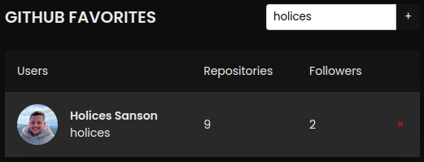

# GitHub Favorites🌃

> Status: Developed ✅

Many times a random profile ends up gaining our attention, be it for a well-written README, or a specific repository we were looking for. Thinking about this problem, I developed (with the help of Rocketseat), an application that has as main functionality to favorite any GitHub user. After entering the desired user, the application will show some GitHub-specific data, such as: profile picture, number of public repositories and followers. With this, the profile will be saved and we can access it whenever we want.

## Technologies used in this project 🛠️

- [HTML](https://developer.mozilla.org/pt-BR/docs/Web/HTML)
- [CSS](https://developer.mozilla.org/pt-BR/docs/Web/CSS)
- [JavaScript](https://developer.mozilla.org/pt-BR/docs/Web/JavaScript)

## Contribute to the development of the project 💻

1. Fork this repository, using the button that appears in the top right corner `fork`.

To get the files onto your machine now, you clone the repository you added to your github. To do this, inside your repository there will be a `code` button where you can copy a url. Use it to run the command inside the folder you want `git clone <link copied>`.

2. Select the IDE of your choice, open the folder of the project in question and look for the file `index.html`, right-click and run it.

3. Edit the code in the way you think will be best for the project, adding features, solving problems you find.

4. Make a `pull request` to the repository of the project in question and describe exactly what has changed and any action needed to test or run it.

## Disclaimer and Copyright ©️
Application developed through the Explorer module of the @Rocketseat education platform

### Thank you in advance for any contribution!
# github-favorites
